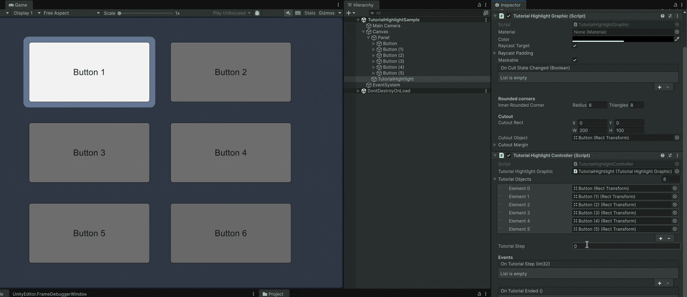

# Tutorial Highlight
[](https://openupm.com/packages/com.gilzoide.tutorial-highlight/)

Easy to use tutorial highlight graphic and controller for Unity UI.



## Features
- Specialized `TutorialHighlightGraphic` that fills the entire rect but the cutout.
  The cutout may be a target `RectTransform` object or a fixed `Rect` value. Uses an optimized custom mesh without any textures.
- Supports inner rounded corners if [Rounded Corners](https://github.com/gilzoide/unity-rounded-corners) package is also installed in the project.
- `TutorialHightlighController` component for easily controlling a list of tutorial steps.
  + Each tutorial step is simply a target `RectTransform` to be highlighted.
  + Call `BeginTutorial` to begin/rewind the tutorial, `AdvanceTutorialStep` to advance to the next step and `EndTutorial` to disable the tutorial entirely.
  + Unity Events `OnTutorialStep` and `OnTutorialEnded` lets users easily hook callbacks to the tutorial.


## How to install
Either:
- Install using [openupm](https://openupm.com/):
  ```
  openupm add com.gilzoide.tutorial-highlight
  ```
- Install using the [Unity Package Manager](https://docs.unity3d.com/Manual/upm-ui-giturl.html) with the following URL:
  ```
  https://github.com/gilzoide/unity-tutorial-highlight.git#1.0.0
  ```
- Clone this repository or download a snapshot of it directly inside your project's `Assets` or `Packages` folder.


## Samples
- [TutorialHighlightSample](Samples~/TutorialHighlightSample): simple sample with a UI tutorial that shows 6 buttons in order.


## How to use
1. Add `TutorialHighlightGraphic` to your UI, usually as a child of the root Canvas for full-screen tutorials.
2. Add `TutorialHightlighController` to your scene, hook up the reference to the `TutorialHighlightGraphic` and target `TutorialObjects`.
3. Call `BeginTutorial` to begin the tutorial at runtime.
4. For each tutorial step, call `AdvanceTutorialStep` to advance to the next step.
5. The tutorial will end and disable itself automatically after calling `AdvanceTutorialStep` during the last step.
6. Enjoy 🍾
